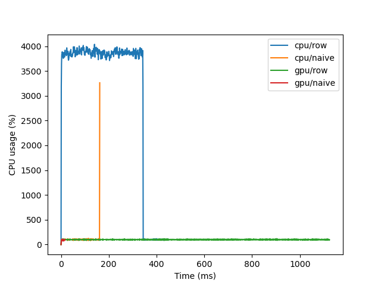

# Matrix multiplication

Daniel Holmberg, 20.01.2023

## Introduction

Multiply the three matrices: A, B, and C;  i.e., you are expected to find the matrix D where D=ABC. 
A, B, and, C contain random numbers in the range of (0, 1) and the dimensions of the matrices are as follows. 

- A is a matrix with dimension 10^6 x 10^3. 
- B is a matrix with dimension 10^3 x 10^6.
- C is a matrix with dimension 10^6 x 1.

## Availability

The code for this assignment is available at [https://github.com/deinal/matrix-multiplication](https://github.com/deinal/matrix-multiplication).

## Programming Language

To solve this task I chose the Python programming language. The matrix multiplication is performed both on CPU and GPU. To do matrix / array operations on CPU I used the `NumPy` library. For GPU accelerated computing I used the `CuPy` library.

## Methodology

Multiplying the matrices was quite resource intensive since their dimensions are very large. The computers working memory might easily become a bottleneck, thus prohibiting a naive multiplication of the whole matrices at once. One way to reduce the memory footprint is to utilize the fact that matrix multiplication is an associative operation. So instead of calculating D = (AB)C we can choose to do D = A(BC) instead. The intermediate result BC only has dimensionality 10^3 x 1 whereas AB would be 10^6 x 10^6.

However, fitting the whole matrices in memory is challenging even if the intermediate result isn't as large. To alleviate memory usage I chose to multiply the matrices on a row by row basis. The rows are created on demand using `cupy.random.rand` for GPU and `numpy.random.rand` for CPU calculations. This leaves almost no memory footprint at the expense of a larger number of function calls to be made to `numpy.dot` and `cupy.dot`.

The computer I ran this exercise on happened to have enough resources to also perform the naive operation D = A(BC) directly without fiddling with rows. For comparisons sake I also did the matrix calculation this way to see what the speedup is like.

## Dataset

The matrices are populated with random samples from the uniform distribution between 0 and 1. After multiplication we get cumulative distributions resembling what a normal distribution would have as CDF. It is nice to see that all runs produce similar cumulative distribution functions - which is a good sanity check to confirm that the row-wise operations work as intended.

    

We can take as a null hyopthesis that the empirical CDF is equal to the theoretical CDF of the normal distribution where the mean and standard deviation parameters are taken directly from the data in the matrix D of every run. We use the Kolmogorov-Smirnov test to see if we reach a confidence level of 95%, i.e. if the p-value is less than 0.05 the null hyopthesis can be rejected. The table below show that the hypothesis indeed checks out. We can also see that the distributions of the different runs have similar mean and standard deviation statistics.

| run | mean | std | p-value |
--- | --- | --- | ---
cpu/row | 1.24999e+08 | 2.28291e+06 | 0.63
cpu/naive | 1.24965e+08 | 2.28137e+06 | 0.64
gpu/row | 1.24996e+08 | 2.28067e+06 | 0.54
gpu/naive | 1.24970e+08 | 2.28264e+06 | 0.95

According to the central limit theorem, when adding independent random variables their normalized sum converges to a normal distribution even if the random variables are sampled from another distribution such as the uniform distribution. The uniform sum distribution specifically (without normalization) is known as the _Irwin–Hall distribution_. It strongly approximates the normal distribution when the number of summed elements is large, which certainly is the case when we perform matrix multiplication on our very large matrices.

## Evaluation

The evolution of RAM usage, CPU percentage, GPU percentage and GPU memory is tracked every millisecond while the matrix multiplication is taking place. The computer hosts an AMD Ryzen Threadripper 3960X CPU chip with 24 cores supporting 2 threads each and an unboosted clock speed of 2.2 GHz. The total amount of RAM is 256GB, of which ~50GB was available at the time of executing the multiplication script. The GPU used is Nvidia's GeForce RTX 3090 with 24GB G6X memory.

Very little RAM is used for the row by row multiplications, as expected. You never need to fit a giant 10^6 x 10^3 matrix into memory, instead we're dealing with 10^3 x 1 and 10^6 x 1 vectors.

    

The naive CPU multiplication places whole matrices in memory and then performs the multiplication very fast raising an (orange) spike in CPU usage. It goes up to around 3300% or so CPU usage. This shows that `NumPy` supports multithreading - in this case the operation uses 33 threads. Under the hood `NumPy` breaks down the task of matrix multiplication into multiple fragments and then process all of them in parallel in a burst-like fashion.

Comparing this to the row wise matrix multiplication on CPU we can see that it takes significantly longer (blue colored line), while using a fraction of the RAM that goes into the naive operation. This time multithreading goes up to around 40 threads, i.e. 4000% CPU usage. We can note that a vanilla Python loop is used for iterating over matrix rows. Since it is dynamic language more work is needed to figure out how objects are going to behave compared to a more low-level statically typed language. `Numpy` functions are therefore much faster since they act as high level interfaces to low-level compiled C or Fortran code.

    

Both GPU runs use a single thread capping at 100% CPU usage. Their RAM usage is also fairly miniscule. Instead matrices are loaded into GPU memory. Since the RTX 3090 has 24GB memory and the naive operation (red) only seems to require 16GB all data can be placed there at once resulting in optimal performance. We can see that the row wise GPU multiplication (green) is the slowest of all runs. The reason for this is firstly due to the slower Python looping, but also due to the amount of time data has to be transferred between RAM and GPU memory which ends up being a bit of a bottleneck here.

    

A GPU has many more threads in comparison to a CPU, and in each thread there are multiple blocks allowing for orders of magnitude more parallelization resulting in quicker compute time. The naive GPU operations takes 16ms which is 10 times faster than the naive CPU operation's 162ms. The row-wise GPU operation takes 1126ms which is over twice as slow to the CPU conutnerpart's 451ms. This is a good example of how not to do computation on a GPU since it's biggest strength - massive parrallalization - is not utilized to its full extent. It's also worth noting that without multithreading on the processor the row-wise CPU computation would most likely be the slowest of them all.

    

## Discussion

Comparing matrix multiplication on a CPU and a GPU is an interesting exercise since you often hear how a GPU is supposed to be better at matrix operations. The data I retrieved showed very well how that is the case - if done the right way. To speed up looping over matrix rows in the row-wise multiplication a library such as `Numba` could be used to translate the function into faster machine code.

The most challenging part for me was figuring out how to track hardware usage while the script is running. Luckily you can use the `multiprocessing` library in Python to launch a separate process where you know the process id. When you have that `psutil` is very conventient for tracking CPU and RAM usage. I didn't find an official library to track the Nvidia GPU stats, but luckily some third party had implemented a way of tracking the output of `nvidia-smi` and made a PyPi library (`gpuinfo`) out of it. Another challenge I faced was getting the row-wise multiplication working because you have to get the dimensions and indices exactly right.
